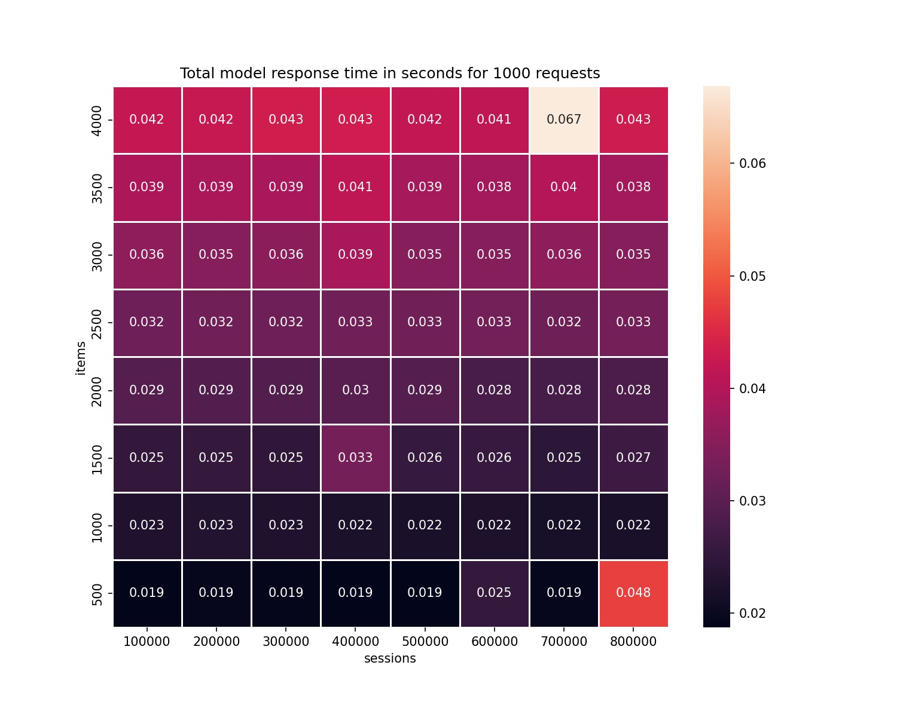
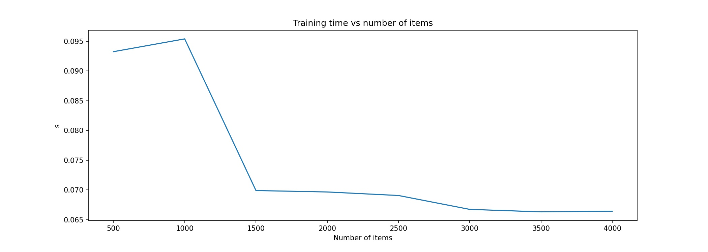
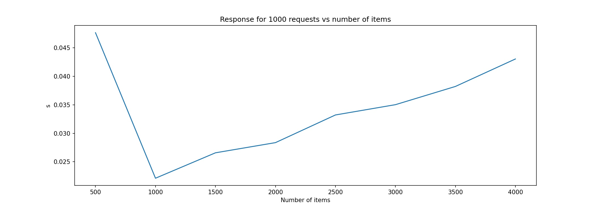
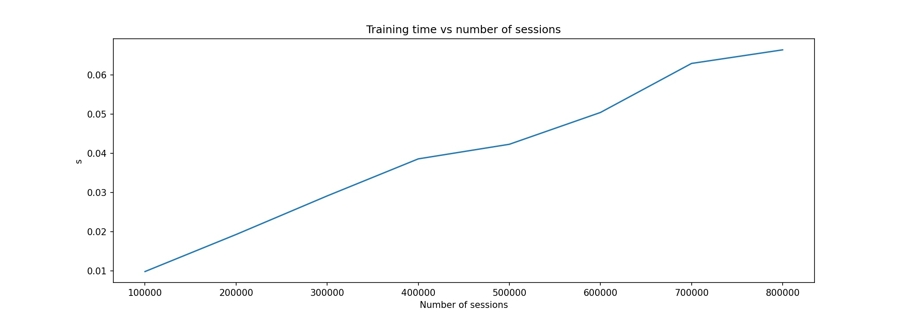
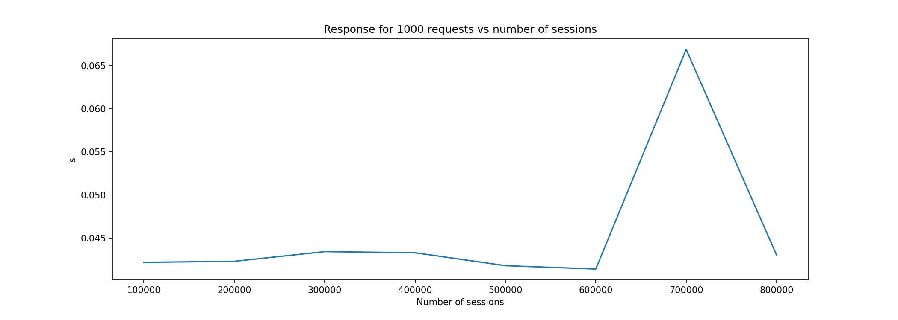

# WSKNN: k-NN recommender for session-based data

[](https://doi.org/10.21105/joss.05639)
[](https://www.python.org)
[](https://www.repostatus.org/#active)

## Weighted session-based k-NN - Intro

Do you build a recommender system for your website? K-nearest neighbors algorithm is a good choice if you are looking for a simple, fast, and explainable solution. Weighted-session-based k-nn recommendations are [close to the state-of-the-art](#sknn-performance), and we don't need to tune multiple hyperparameters and build complex deep learning models to achieve a good result.

## Documentation

API Documentation is available here: [WSKNN Docs](https://wsknn.readthedocs.io/en/latest/index.html)

## How does it work?

You provide two input structures as **training** data:

```
sessions : dict
               sessions = {
                   session id: (
                       [sequence of items with user interaction],
                       [timestamp of user interaction per item],
                       [(optional) sequence of event names],
                       [(optional) sequence of weights]
                   )
               }

items : dict
        items = {
            item id: (
                [sequence of sessions with an item],
                [the first timestamp of each session with an item]
            )
        }
```

And you ask a model to recommend products based on the user session:

```
user session: 
    {session id:
        [[sequence of items], [sequence of timestamps], [optional event names], [optional weights]]
    }
```

The package is lightweight. It depends only on the `numpy` and `pyyaml`. 

Moreover, we can provide a package for non-programmers, and they can use `settings.yaml` to control a model behavior.


## Why should we use WSKNN?

- training is faster than deep learning or XGBoost algorithms, model memorizes map of session-items and item-sessions,
- recommendations are easy to control. We can change how the algorithm works in just a few lines... of text,
- as a baseline, for comparison of deep learning / XGBoost architectures,
- swift prototyping,
- easy to run in production.

The model was created along with multiple other approaches: based on RNN (GRU/LSTM), matrix factorization, and others. [Its performance was always very close to the level of fine-tuned neural networks](#comparison-between-dl-and-wsknn), but it was much easier and faster to train.

## What are the limitations of WSKNN?

- model memorizes session-items and item-sessions maps, and if your product base is large, and you use sessions for an extended period, then the model may be too big to fit an available memory; in this case, you can 
categorize products and train a different model for each category,
- response time may be slower than from other models, especially if there are available many sessions,
- there's additional overhead related to the preparation of the input.

## Example

Example below is available in `demo-notebooks/demo-readme.ipynb` notebook.

```python
import numpy as np
from wsknn import fit
from wsknn.utils import load_gzipped_pickle

# Load data
ITEMS = 'demo-data/recsys-2015/parsed_items.pkl.gz'
SESSIONS = 'demo-data/recsys-2015/parsed_sessions.pkl.gz'

items = load_gzipped_pickle(ITEMS)
sessions = load_gzipped_pickle(SESSIONS)
imap = items['map']
smap = sessions['map']

# Train model
trained_model = fit(smap,
                    imap,
                    number_of_recommendations=5,
                    weighting_func='log',
                    return_events_from_session=False)

# Get sample session
test_session_key = np.random.choice(list(smap.keys()))
test_session = smap[test_session_key]
print(test_session)  # [products], [timestamps]

```

```shell
[[214850771, 214677615, 214651777], [1407592501.048, 1407592529.941, 1407592552.98]]
```

```python

recommendations = trained_model.recommend(test_session)
for rec in recommendations:
    print('Item:', rec[0], '| weight:', rec[1])

```

**Output recommendations**

```shell
Item: 214676306 | weight: 1.8718411072574241
Item: 214850758 | weight: 1.2478940715049494
Item: 214561775 | weight: 1.2478940715049494
Item: 214821020 | weight: 1.2478940715049494
Item: 214848322 | weight: 1.2478940715049494
```

## Setup

Version 1.x of a package can be installed with `pip`:

```shell
pip install wsknn
```

It works with Python versions greater or equal to 3.8.

## Requirements

| Package Version | Python versions | Requirements                                |
|-----------------|-----------------|---------------------------------------------|
| 0.1.x           | 3.6+            | numpy, pyyaml                               |
| 1.1.x           | 3.8+            | numpy, more_itertools, pyyaml               |
| 1.2.x           | 3.8+            | numpy, more_itertools, pandas, pyyaml, tqdm |

## Contribution

We welcome all submissions, issues, feature requests, and bug reports! To learn how to contribute to the package please visit [CONTRIBUTION.md file](https://github.com/nokaut/wsknn/blob/main/CONTRIBUTING.md)

## Developers

- Szymon Moliński (Sales Intelligence : Digitree Group SA)

## Citation

Moliński, S., (2023). WSKNN - Weighted Session-based K-NN recommender system. Journal of Open Source Software, 8(90), 5639, https://doi.org/10.21105/joss.05639

## Bibliography

### Data used in a demo example

- David Ben-Shimon, Alexander Tsikinovsky, Michael Friedmann, Bracha Shapira, Lior Rokach, and Johannes Hoerle. 2015. RecSys Challenge 2015 and the YOOCHOOSE Dataset. In Proceedings of the 9th ACM Conference on Recommender Systems (RecSys '15). Association for Computing Machinery, New York, NY, USA, 357–358. DOI:https://doi.org/10.1145/2792838.2798723

### Comparison between DL and WSKNN

- Twardowski, B., Zawistowski, P., Zaborowski, S. (2021). Metric Learning for Session-Based Recommendations. In: Hiemstra, D., Moens, MF., Mothe, J., Perego, R., Potthast, M., Sebastiani, F. (eds) Advances in Information Retrieval. ECIR 2021. Lecture Notes in Computer Science(), vol 12656. Springer, Cham. https://doi.org/10.1007/978-3-030-72113-8_43

### SKNN performance

The article compares performance of mutiple session-based recommender systems.

- Ludewig, M., Jannach, D. Evaluation of session-based recommendation algorithms. User Model User-Adap Inter 28, 331–390 (2018). https://doi.org/10.1007/s11257-018-9209-6

## Funding


- Development of the package was partially based on the research project
**E-commerce Shopping Patterns Prediction System** that 
was founded under Priority Axis 1.1 of Smart Growth Operational Programme 2014-2020 for Poland
co-funded by European Regional Development Fund. Project number: `POIR.01.01.01-00-0632/18`

## Computational Performance

As a rule of thumb you should assume that you should have ~2 times more memory available than your model's memory size

- Used machine has 16GB RAM and 4-core CPU with 4.5 GHz frequency
- testing sample size - 1000 sessions
- max session length - 50 events
- min session length - 1 event
- basic data types (integers)

All performance characterists were derived in [this notebook](./demo-notebooks/test_ops_times.ipynb), and you can use it for your own performance tests.

### Training time in relation to session length vs number of items


### Total response time for 1000 requests in relation to session length vs number of items



### Model size in relation to session length vs number of items


### Relation between training time and increasing number of items




### Relation between response time and increasing number of items (for 1000 requests)



### Relation between training time and increasing number of sessions




### Relation between response time and increasing number of sessions (for 1000 requests)


