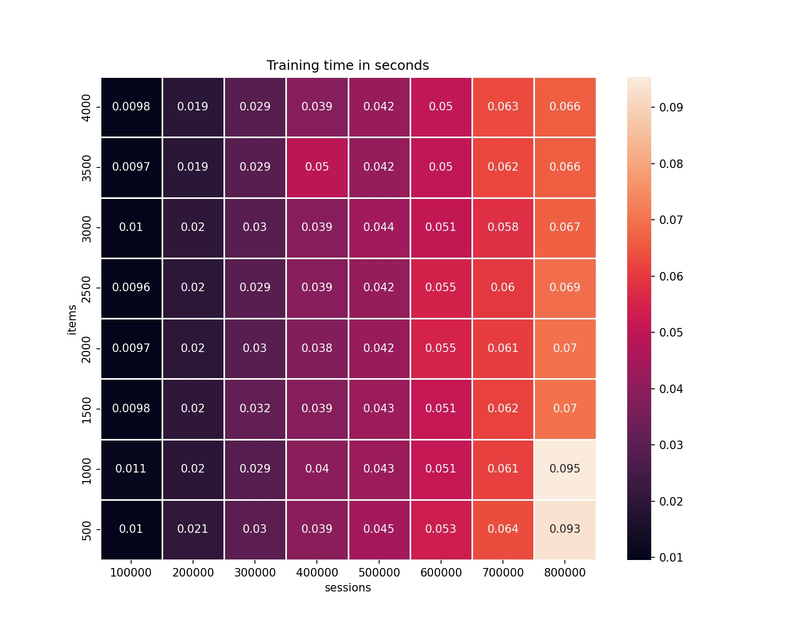
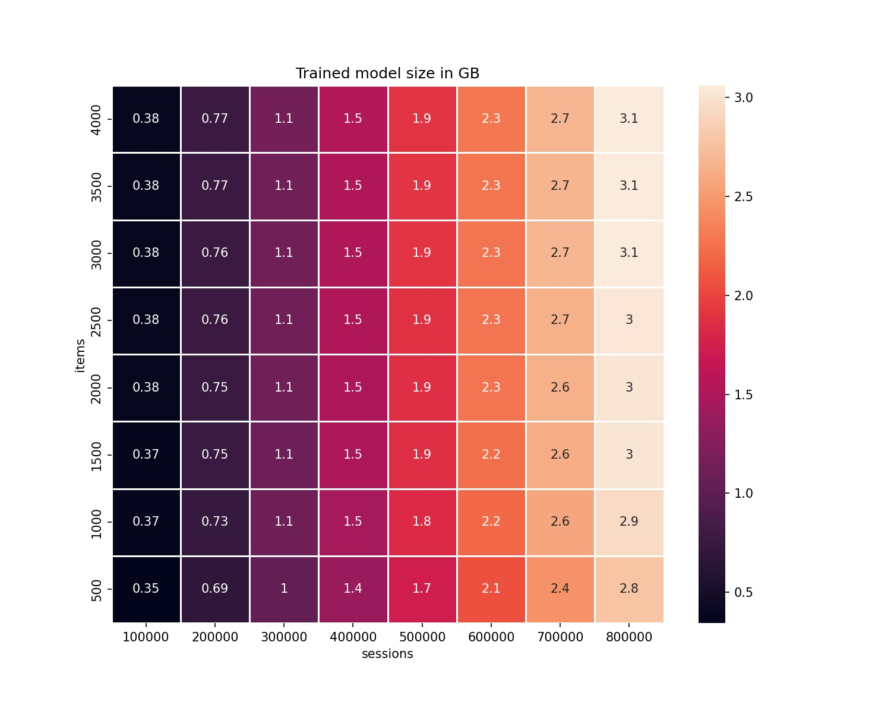
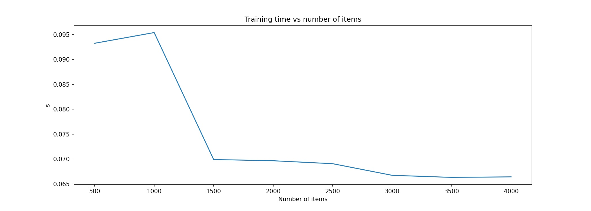
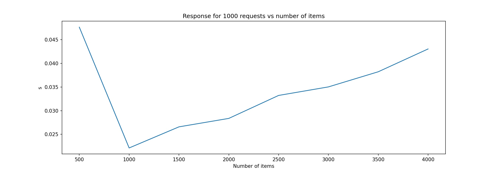
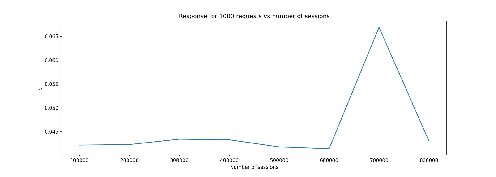

Introduction
============

Does this data structure look familiar to you?

.. code-block:: python

    web_event = {
        'user_id': 'xyz',
        'event_type': 'click',
        'time': '2000-01-01 12:00:00',
        'session_id': 'a12',
        'product_id': 'c-49'
    }

This is a single event that can be traced from web services and mobile devices. Every field in this dictionary is important. We can group multiple objects of this type into a **sequence** or a **session** that contains:

- **multiple events**,
- **users' interactions with products**,
- **paths - event sequences - that leads to the transaction**,
- **timestamped actions of a user**.

We can use a set of a product interaction sequences to create a recommendation engine. A recommendation system analyzes sessions, and builds a mappings between products that are grouped with other products within users sessions. We can retrieve information about items, that will be most likely viewed or bought by the users. Finally, we can recommend products that are optimized for a user session (past interactions with products).

How does it work?
-----------------

We provide two input structures as a **training** data:

**SESSIONS**:

.. code-block:: none

               sessions = {
                   session id: (
                       [sequence of items with user interaction],
                       [timestamp of user interaction per item],
                       [(optional) sequence of event names],
                       [(optional) sequence of weights]
                   )
               }

**ITEMS / PRODUCTS**:

.. code-block:: none

        items = {
            item id: (
                [sequence of sessions with an item],
                [the first timestamp of each session with an item]
            )
        }

And we may ask a model to recommend products based on user session:

**USER SESSION**

.. code-block:: none

    {session id:
        [[sequence of items], [sequence of timestamps], [optional event names], [optional weights]]
    }

The package is lightweight. It depends only on the ``numpy`` and ``pyyaml``.

Moreover, we can provide a package for non-programmers, and they can use ``settings.yaml`` to control a model behavior.

Why should we use WSKNN?
------------------------

- training is **faster** than deep learning or XGBoost algorithms, model memorizes map of session-items and item-sessions,
- recommendations are **easy to control**. We can change how the algorithm works with s few settings,
- as a **baseline**, for comparison of deep learning / XGBoost architectures,
- **fast prototyping**,
- easy to **run in production**.

We have developed and tested this model along with other techniques: based on *RNN* (*GRU/LSTM*), *matrix factorization*, and custom deep learning architectures. A performance of ``WSKNN`` model was always very close to the level of a fine-tuned and custom neural network. On the other hand, this algorithm is much easier to build, control, understand, and run in production.

What are the limitations of WSKNN?
----------------------------------

- model *memorizes session-items and item-sessions maps*, and if your product base is large and you use sessions for an extended period, then the model may be too big to fit an available memory; in this case, you can categorize products and train a different model for each category,
- *response time may be slower than from other models*, especially if there are available many sessions,
- there's *additional overhead related to the preparation of the input*. But this is related to the every other model, except simple Markov Models.

Setup
-----

The package can be installed with ``pip``:

.. code-block:: bash

    pip install wsknn

It works with Python versions greater or equal to 3.8.

Requirements
------------

+-----------------+-----------------+-----------------------------------------------------------------+
| Package Version | Python versions | Requirements                                                    |
+=================+=================+=================================================================+
| >=0.1           | 3.6+            | ``numpy``, ``pyyaml``                                           |
+-----------------+-----------------+-----------------------------------------------------------------+
| 1.x+            | 3.8+            | ``numpy``, ``pyyaml``, ``more_itertools``                       |
+-----------------+-----------------+-----------------------------------------------------------------+
| 1.2.x           | 3.8+            | ``numpy``, ``more_itertools``, ``pandas``, ``pyyaml``, ``tqdm`` |
+-----------------+-----------------+-----------------------------------------------------------------+

Developers
----------

- Szymon Moliński (Sales Intelligence : Digitree Group SA), Github: @SimonMolinsky

Citation
--------

Moliński, S., (2023). WSKNN - Weighted Session-based K-NN recommender system. Journal of Open Source Software, 8(90), 5639, https://doi.org/10.21105/joss.05639

Bibliography
------------

Data used in a demo example
...........................

- David Ben-Shimon, Alexander Tsikinovsky, Michael Friedmann, Bracha Shapira, Lior Rokach, and Johannes Hoerle. 2015. RecSys Challenge 2015 and the YOOCHOOSE Dataset. In Proceedings of the 9th ACM Conference on Recommender Systems (RecSys '15). Association for Computing Machinery, New York, NY, USA, 357–358. DOI:https://doi.org/10.1145/2792838.2798723

Comparison between DL and WSKNN
...............................

- Twardowski, B., Zawistowski, P., Zaborowski, S. (2021). Metric Learning for Session-Based Recommendations. In: Hiemstra, D., Moens, MF., Mothe, J., Perego, R., Potthast, M., Sebastiani, F. (eds) Advances in Information Retrieval. ECIR 2021. Lecture Notes in Computer Science(), vol 12656. Springer, Cham. https://doi.org/10.1007/978-3-030-72113-8_43

SKNN performance
................

The article compares performance of mutiple session-based recommender systems.

- Ludewig, M., Jannach, D. Evaluation of session-based recommendation algorithms. User Model User-Adap Inter 28, 331–390 (2018). https://doi.org/10.1007/s11257-018-9209-6

Performance
-----------

As a rule of thumb you should assume that you should have ~2 times more memory available than your model's memory size

- Used machine has 16GB RAM and 4-core CPU with 4.5 GHz frequency
- testing sample size - 1000 sessions
- max session length - 30 events
- min session length - 1 event
- basic data types (integers)

Training time in relation to session length vs number of items
..............................................................

Total response time for 1000 requests in relation to session length vs number of items
......................................................................................

..  image:: images/response_time_vs_sessions_vs_items_heatmap.jpg
    :width: 400
    :alt: Total response time for 1000 requests in relation to session length vs number of items

Model size in relation to session length vs number of items
...........................................................

Relation between training time and increasing number of items
.............................................................

Relation between response time and increasing number of items (for 1000 requests)
.................................................................................

Relation between training time and increasing number of sessions
................................................................

..  image:: images/training_time_vs_number_of_sessions_plot.jpg
    :width: 400
    :alt: Relation between training time and increasing number of sessions

Relation between response time and increasing number of sessions (for 1000 requests)
....................................................................................

Funding
-------

..  image:: images/eu_funding_logos/FE_POIR_poziom_engl-1_rgb.jpg
    :width: 400
    :alt: Funding Bodies logos

Development of the package was partially based on the research project
**E-commerce Shopping Patterns Prediction System** that
was founded under Priority Axis 1.1 of Smart Growth Operational Programme 2014-2020 for Poland
co-funded by European Regional Development Fund. Project number: `POIR.01.01.01-00-0632/18`