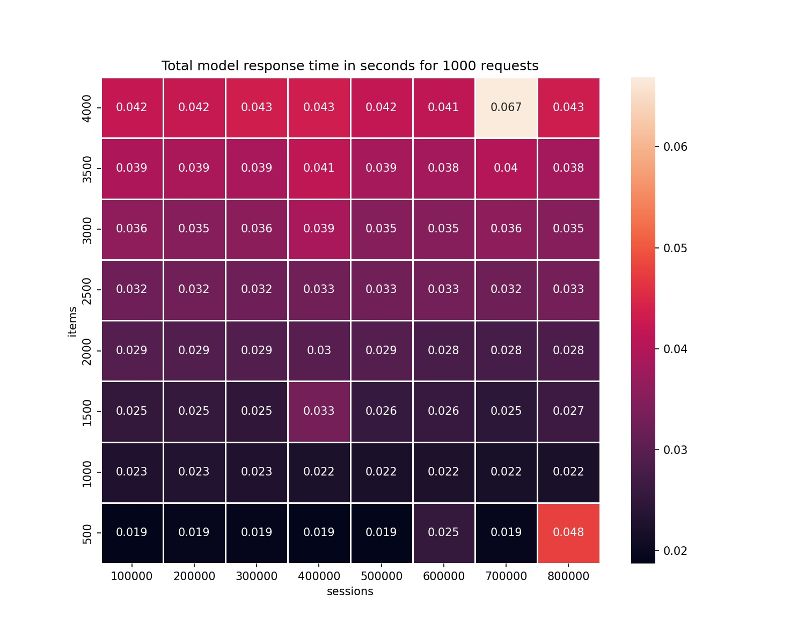
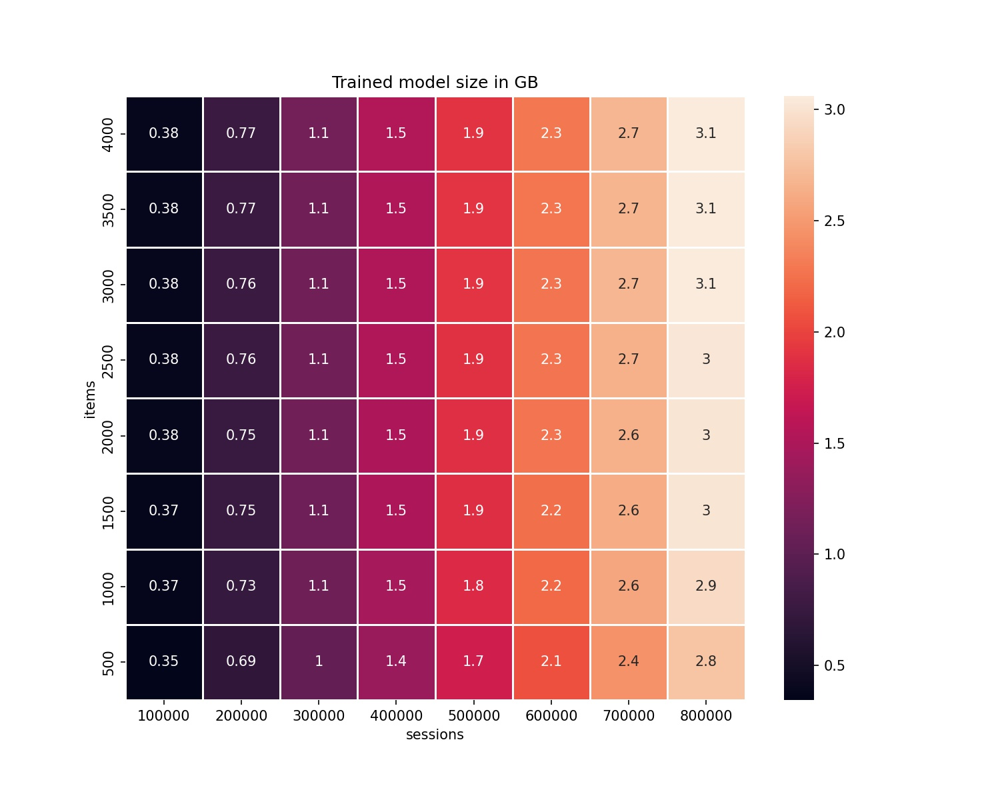

# Summary

The users of e-commerce systems generate vast amounts of unstructured, sequential data streams. Each sequence is a varying-length list of directional (timestamped) user-product interactions. There are hidden patterns within those sequences. Users tend to interact with similar products, and interactions change over time. Based on this behavior, we can recommend the sequence of products the user may be interested in.

The `WSKNN` (*Weighted Session-based K-Nearest Neighbors*) package is a lightweight tool for modeling user-item interactions and making recommendations from sequential datasets [@Latifi2020SessionawareRA]. It is based on the k-Nearest Neighbors algorithm (k-NN), which works with categorical, sequential, and timestamped data mainly generated in e-commerce systems. The package may be a stand-alone recommender, a reference against the more complex recommender systems, or a part of a Machine Learning pipeline.

# Statement of need

`WSKNN` is an abbreviation from *Weighted Session-based k-NN recommender*. The algorithm is a tuned and enhanced version of the **Vector Multiplication Session-Based kNN (V-SKNN)** algorithm [@Ludewig2018]. The package utilizes the k-NN algorithm that works with loosely structured sequential data, where sequences can have different lengths. This data type is the most common representation of the timestamped events stream from customers. A dataset example is *RecSys Challenge 2015 and the YOOCHOOSE Dataset* [@recsys2015data].

The `WSKNN` recommender was designed to evaluate complex deep-learning architectures [@Twardowski2021]. During the research, it became clear that the k-NN model's performance is close to or exceeds the performance of neural networks algorithms (see [experimental comparison](#experiments)). Moreover, the literature analysis about recommender systems shows that the k-NN-based solutions are performing well in different conditions [@Ludewig2018]. It makes `WSKNN` a great benchmarking tool against novel algorithms and architectures and the first-choice tool for the fresh start and design of the recommender system.

The package's algorithm can be a recommender for small and medium-sized datasets. During the internal studies in the company, the algorithm performed well for the small datasets (25k sessions; 3k items) and bigger datasets - see MovieLens 25M tutorial [@movielenstutorial25]. The model has its limitations, and the main drawback is that it is memory-hungry. As a memory-based method, it can grow to the moment when its usage is unfeasible. It could be an issue for production environments where the memory costs may exceed potential benefits.

The package was created during the research project of the Sales Intelligence Sp. z o.o. company [@Twardowski2021]. The company owns the price comparison service *Nokaut.pl* and cooperates with multiple big stores across Poland. Thus, it has access to vast amounts of sequential data sources. Currently, the package is used for SMS and mailing recommendations for big customers.

# Related work

A similar architecture can be found in a stand-alone repository [@recsystemsrepo] that seems to be not actively maintained and is linked to a specific publication [@Latifi2020SessionawareRA]. The main technical difference between `WSKNN` and the *V-SKNN* model from the presented repository is that the former is a ready-to-use package. The analytical differences are related to the fact that `WSKNN` has more ways of session-weighting up to a point where custom heuristics can be applied to the recommendations. The *W* letter in `WSKNN` indicates that it differs from the baseline *V-SKNN* algorithm, utilizing external weighting factors (prices, weights applied to actions).

The other example of a repository with scripts that is not a package is [@gru4recrepo] with Python implementation of **Gru4Rec** session-based recommender [@Hidasi2015SessionbasedRW].

# Package structure

The package is lightweight. It depends on the `numpy` [@harris2020array], `pandas` [@reback2020pandas], `tqdm` [@casper_da_costa_luis_2023_8233425], `more_itertools` [@moreitertools], and `pyyaml` [@pyyaml] libraries. It works with currently supported Python versions, starting from Python 3.8. It has two main functions:

- `fit()` to build a memory representation of a model as Python dictionaries with the session-items and item-sessions maps of varying sizes.
- `predict()` to return recommendations. It is worth noticing that **the recommendation strategy may be altered after fitting a model**; it allows testing different weighting scenarios in parallel without additional models training.

The user may pass additional parameters to the `predict()` method as a dictionary to control model behavior on the fly. Those parameters are:

- the number of recommendations,
- the number of neighbors to choose items from (**the closest neighbors**),
- the sampling strategy of neighbors (common items, recent sessions, random subset, custom weights assigned to events' type),
- the sample size (an initial subset of neighbors to look for the closest neighbors),
- a session similarity weighting function,
- an item ranking strategy,
- should algorithm return items that are in the recommended session?
- is there any event (user action) that must be performed within a session to build a similarity map (for example, the *transaction* event)?
- should the algorithm recommend random items if the neighbors-items-set is smaller than the number of recommendations?

The `YAML` file with documented options is provided in the top level of the package repository as `model_settings.yaml`. The user may load those settings with `pyyaml` with the function `parse_settings()`. Then, a dictionary with settings may be passed to the `predict()` function.

The sample flow and recommendations are presented in the repository [@wsknnrepo]. The package has built-in evaluation metrics:

- the **mean reciprocal rank** of top `k` recommendations,
- the **precision** score of top `k` recommendations,
- the **recall** score of top `k` recommendations.

The package can process static JSON-lines, gzipped JSON-lines files, and static `CSV` files with e-commerce events. The recommended way of parsing is to pass `pandas` `DataFrame` for large datasets.

The primary data types are `Items` and `Sessions`. Those classes store item-sessions and session-items mappings and session-related attributes. Those may be updated with the new events.

In the near future, the package will introduce the `tensorflow` [@tensorflow2015-whitepaper] version of the algorithm. It is internal work within the company. The `Items` and `Sessions` classes currently have the metadata attributes that allow data transformation from the custom format into `tensorflow` tensors.

## Data Formats

The basic data type required by the algorithm is an **event**. An **event** has

- session index, or user index,
- a product with which the user interacts,
- timestamp of each interaction,
- (optional) action type,
- (optional) other information, for example, product price, quantity, and user type.

A group of events with the same *session index* or *user index* is a **session**. A **session** is a sequence of events whose length is not fixed.

The example of a **session** stored by the model is:

```json
{ "user xyz": [
 ["item a", "item b", "item h", "item n", "none"],
 [
    "2022-01-01 09:00:00",
    "2022-01-01 09:03:12",
    "2022-01-01 09:03:30",
    "2022-01-01 10:43:56",
    "2022-01-01 10:44:21"
 ]
]
}

```

It can be used for recommendations, but `WSKNN` may use additional weights provided by the user for rating specific products:

```json
{ "user xyz": [
 ["item a", "item b", "item h", "item n", "none"],
 [
    "2022-01-01 09:00:00",
    "2022-01-01 09:03:12",
    "2022-01-01 09:03:30",
    "2022-01-01 10:43:56",
    "2022-01-01 10:44:21"
 ],
 ["view", "view", "add to cart", "add to cart", "transaction"],  # action types
 [0, 0, 0, 0, 230.87]  # total "value" of an action
]
}

```

The other factors that the recommender may include are:

-  The position of a product in a sequence,
-  The length of a sequence,
-  The recency of a sequence,
-  A specific action type in a sequence (for example *transaction*), sessions without transactions are excluded, or products in sessions that ended up in a transaction are more likely recommended,
- Custom weights applied to the sequence, for example, *price*.

# Experiments

This section describes the performance of `WSKNN`. The table comes from internal experiments at *Sales Intelligence Sp. z o.o.*. The algorithm was compared to Session Metric Learning algorithms (`SML-RNN-*`) [@Twardowski2021], `GRU4Rec` [@gru4recrepo], popularity-based recommender (`POP`), and Markov model (`MM`). A comparison has been performed on the RecSys-2015 dataset [@recsys2015data]; 90% of the oldest sessions were used as a training set, and the rest as a test set. The dataset contains 7 981 581 sessions (44% unique), 31 708 505 events, and 37 486 items. Monitored metrics are recall (REC@5, REC@20), mean reciprocal rank (MRR@5, MRR@20), mean average precision MAP@20, hit rate HR@20, training time, and latency - how long does it take for a model to prepare recommendations for 10% of the newest session in a dataset.

| Algorithm           | MAP@20     | REC@20      | HR@20     | MRR@20      | REC@5     | MRR@5      | Training time [s] | Test time [s] |
| ------------------- | ---------- | ----------- | --------- | ----------- | --------- | ---------- | ----------------- |---------------|
| WSKNN               | 0.036      | 0.433       | 0.663     | 0.303       | 0.314     | 0.281      | 0.8               | 126.7         |
| SML-RNN-AllLoss     | 0.036      | 0.427       | 0.654     | 0.287       | 0.292     | 0.264      | 17110.5           | 106.6         |
| GRU4Rec             | 0.031      | 0.377       | 0.575     | 0.253       | 0.259     | 0.233      | 1254.4            | 52.4          |
| SML-RNN-TripletLoss | 0.027      | 0.338       | 0.509     | 0.162       | 0.195     | 0.138      | 25096.6           | 57.3          |
| MM                  | 0.033      | 0.262       | 0.391     | 0.177       | 0.186     | 0.164      | 0.8               | 1             |
| POP                 | 0.006      | 0.086       | 0.126     | 0.029       | 0.036     | 0.022      | 0.4               | ~0            |

We see that performance on analytical metrics is close to that of RNN-based models, but the `WSKNN` model is worst regarding response times. Detailed comparison with more models and datasets is presented in [@Twardowski2021].

## Performance

The model's performance concerning the number of sessions and items in a set is presented in the package repository in the `README.md` file. The most important are training times, response times, and model size. The figures below show those metrics in relation to the number of sessions and the number of items in the training dataset.

Testing environment:

- Used machine has 16GB RAM and 4-core 4.5 GHz CPU
- testing sample size - 1000 sessions
- max session length - 50 events
- min session length - 1 event
- basic data types (integers)

### Training time in relation to session length vs number of items


### Total response time for 1000 requests in relation to session length vs number of items



### Model size in relation to session length vs number of items



Additionally, increasing the number of items doesn't affect training time but increases response time. Increasing the number of sessions increases training time, but its effect on response time is negligible.

# Limitations

As with every Machine Learning system, `WSKNN` has its limitations:

- model *memorizes session-items and item-sessions maps*, and if the product base is significant, and we use sessions for an extended period, then the model may be too big to fit into memory; in this case, we can categorize products and train a different model for each category. Benchmarking shows that model memory size is directly related to the number of sessions.
- Response time may be slower than from other models, especially if there are many items to recommend. Benchmarking shows that the mean response time increases with the number of items used for training,
- There’s additional overhead related to preparing the data structure for modeling. It can be done as a stand-alone step because the model uses Python dictionaries with session-items and item-sessions maps. `WSKNN` has a built-in `preprocessing` module and `Items` and `Sessions` classes, which transform and store common events structure into the model's format.

# Acknowledgements

Development of the package was partially based on the research project E-commerce Shopping Patterns Prediction System that was founded under Priority Axis 1.1 of Smart Growth Operational Programme 2014-2020 for Poland, co-funded by European Regional Development Fund. Project number: POIR.01.01.01-00-0632/18

# References

